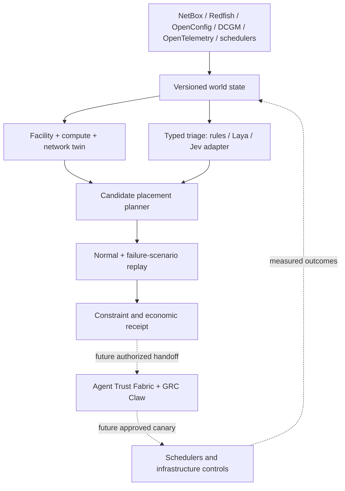

# WorldOps

**An inspectable infrastructure world model and placement benchmark for AI factories.**

WorldOps asks where a workload can run when GPU capacity, rack power, cooling, network resilience, data latency, and cost all matter. The first release evaluates a deterministic **200-node synthetic AI factory**. It compares first-fit and cheapest-GPU placement with a constraint-aware strategy, then emits a machine-readable decision receipt. No connector reads a real facility and no code changes production infrastructure.

```bash
PYTHONPATH=src python3 -m worldops.cli --output generated/comparison.json
PYTHONPATH=src python3 -m unittest discover -s tests -v
```

The output has a world digest, version, selected nodes, hourly modeled cost, violations by scenario, rejected-candidate count and an `ADVISORY_ONLY_NOT_AUTHORIZED` authority label. The example's monetary values are illustrative inputs, **not measured savings or customer economics**. Run `python3 -m json.tool generated/comparison.json` to inspect the complete receipt.

## Why a separate project?

[AI Factory Revenue Twin](https://github.com/AAH20/ai-factory-revenue-twin) models GPU/network economics and bounded remediation; [NVIDIA AI Factory Reliability Platform](https://github.com/AAH20/nvidia-ai-factory-reliability-platform) focuses on day-two health; [Network Change Intelligence Twin](https://github.com/AAH20/network-change-intelligence-twin) tests fabric changes. WorldOps owns the **cross-domain placement decision** and its counterfactual benchmark. It imports evidence from those systems through future versioned contracts rather than duplicating their engines.



The solid path is the local reference implementation. Dashed links are planned integration boundaries. The planner uses deterministic rules; it does **not** depend on model output. `RulesTriage` and an optional `LayaTriage` adapter implement a small typed-decision port for routing events to human specialists. The Laya adapter is not installed or calibrated by default, and its confidence is never an authorization signal. Jev can be compared behind the same port after building a common, held-out infrastructure dataset. [Laya documents limitations of its base checkpoints and probability calibration](https://github.com/NandhaKishorM/laya).

## The executable case study

`worldops.fixture.make_factory()` produces 20 racks and 200 eight-GPU nodes. Three jobs compete for placement: customer inference, model training and batch embeddings. The declared scenario set derates cooling in two racks and degrades network paths/latency in those same racks.

| Strategy | Implementation | What the receipt tests |
| --- | --- | --- |
| First fit | First node with local GPU space | Shared rack and network constraints are evaluated afterwards |
| Cheapest GPU | Lowest listed GPU-hour price with local capacity | Whether apparent unit price remains feasible |
| WorldOps | Greedy cost/latency ranking among candidates that pass declared scenarios | Whether a feasible placement exists under the modeled constraints |

WorldOps currently uses a **greedy search**, so it provides no global optimality guarantee. It counts modeled GPU-hour charges and incremental GPU energy; it omits cooling plant cost, amortization, demand charges and real billing. A contingency failure marks the entire plan infeasible; this is a conservative test, not an estimate of failure probability. See [benchmark protocol](docs/BENCHMARKS.md).

## Production trajectory

1. **Reference baseline:** synthetic fixtures, strict input validation, deterministic replay, baseline comparisons and CI. This is implemented.
2. **Observed shadow mode:** read-only adapters to inventory, telemetry and scheduling; timestamps, units, source identity and data-quality flags; no production writes.
3. **Calibrated twin:** validate power, cooling, network and workload predictions on held-out operator data; publish prediction error and uncertainty by site.
4. **Operator-controlled pilot:** signed requests, scoped authority, human approval, canary, rollback and independent outcome measurement.
5. **Multi-site optimization:** larger solver, mixed workload types, failure probabilities, energy tariffs and procurement/capacity decisions. A constrained optimizer such as OR-Tools is a candidate, not part of v0.1.

The commercial layer could provide managed connector operations, site-calibrated twins, support, large-scale optimization and independently verified outcome reporting. The public schema, replay engine, safety contract and benchmark should remain inspectable. See [architecture and boundaries](docs/ARCHITECTURE.md).

## Related ecosystem

- [Agent Trust Fabric](https://github.com/AAH20/agent-trust-fabric): future scoped-authority handoff.
- [GRC Claw](https://github.com/AAH20/GRC_Claw): future governance/evidence mapping.
- [AI Infrastructure Procurement Platform](https://github.com/AAH20/ai-infrastructure-procurement-platform): future supplier price and contract inputs.
- [Audience Swarm Lab](https://github.com/AAH20/audience-swarm-lab) and [Decision World](https://github.com/AAH20/decision-world): demand and business-scenario inputs, explicitly separate from measured infrastructure state.

WorldOps is Apache-2.0 licensed. For design and integration work, see [A2Z SOC](https://a2zsoc.com).
